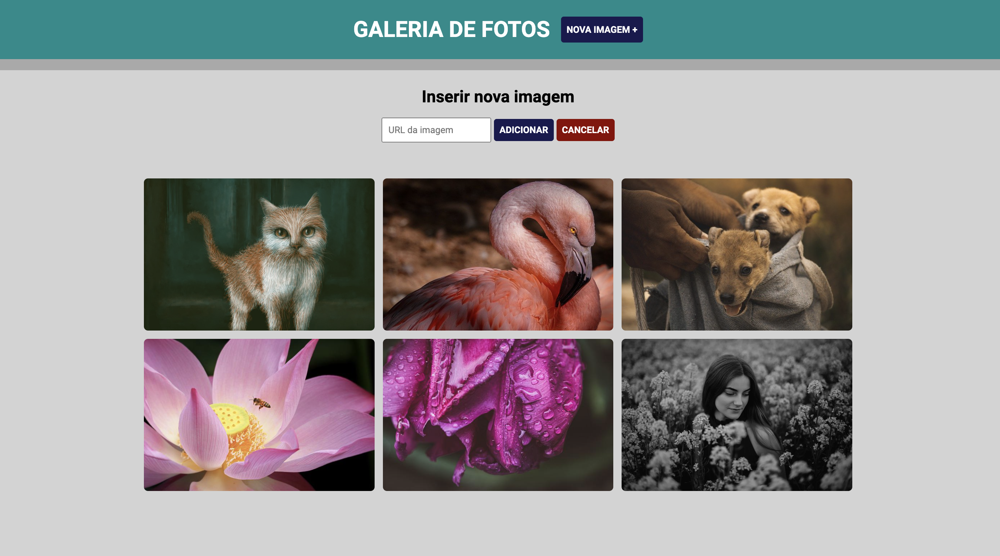

# Galeria de fotos

Galeria de fotos desenvolvida em **HTML**, **CSS** e **JQuery**. Galeria armazena fotos através de seu endereço web.
É possível abrir essas imagens em tamanho real através do link inferior em cada imagem.

Projeto desenvolvido no curso de Full Stack Python da EBAC - Escola Britânica de Artes Criativas e Tecnologia.

## 🚀 Começando

Estas instruções permitirão que você obtenha uma cópia do projeto em execução em sua máquina local para fins de desenvolvimento e teste.

### Instalação

Siga estas etapas a seguir para configurar o ambiente de desenvolvimento:

1. Clone este repositório em sua máquina local.
2. Abra o projeto no VSCode.
3. Instale a extensão Live Server no VSCode. (https://github.com/ritwickdey/vscode-live-server-plus-plus)
3. Clique em Go Live no canto inferior direito do VSCode para abrir o projeto no browser.

## 🛠️ Ferramentas utilizadas para construção do projeto

* **HTML** - Linguagem de marcação utilizada na construção de páginas na Web.
* **CSS** - Cascading Style Sheets é um mecanismo para adicionar estilos a uma página web.
* **jQuery** - Biblioteca livre que contém funções de JavaScript que interage com páginas em HTML.

## ✒️ Autor

Guilherme Ferreira Camargo
